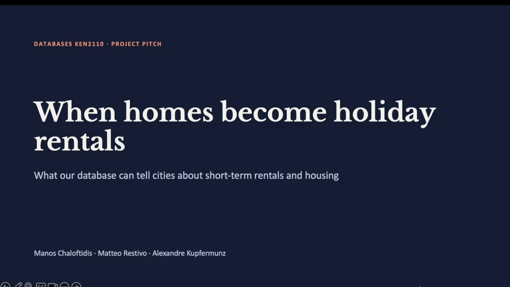

# Airbnb Housing Market Analysis Database

**Course:** Databases KEN2110, Data Modelling  
**Team:** Manos Chaloftidis, Matteo Restivo, Alexandre Kupfermunz  

## 1. Project overview

This repository contains the relational database for our project on short-term rentals and the housing market. It models rental listings, the hosts and properties behind them, the booking platforms, and the housing market around them (rents, income, regulations).

The design started from an ERD (see `docs/erd.pdf`). We normalized it to 3NF (see `docs/normalization.md`) and implemented it in MySQL. In Week 5 we loaded real data for Barcelona: Airbnb listings, neighborhood rents and neighborhood household income. In Week 6 we finalized the schema, checked everything on MySQL, and documented all queries.

**Societal problem:** when homes become holiday rentals, residents can lose housing and rents can rise. The database helps a city see where short-term rentals are concentrated and how that relates to rent and income.

## 2. Stakeholder video (Week 4)

[](media/pitch_video.mp4)

> **[Watch the Project Pitch Video (MP4)](media/pitch_video.mp4)**  
> *When homes become holiday rentals: What our database can tell cities about short-term rentals and housing.*

## 3. Repository structure

```
.
├── README.md
├── requirements.txt                      Python packages (openpyxl)
├── .gitignore
├── media/
│   ├── pitch_video.mp4                   Week 4 stakeholder video
│   └── pitch_thumbnail.png               Thumbnail used in this README
├── data/
│   ├── raw/
│   │   ├── 2023_atles_renda_bruta_llar.csv     Income source (CC BY 4.0)
│   │   └── trimestral_bcn_lloguer_m2.xlsx      Rent source (downloaded by script)
│   │       (listings.csv from Inside Airbnb is downloaded here too, but not
│   │        stored in git)
│   └── cleaned/                          Output of the cleaning scripts
│       ├── city.csv, neighborhood.csv, host.csv, property.csv,
│       │   host_property.csv, platform.csv, listing.csv,
│       │   listing_snapshot.csv, housing_market_observation.csv
│       ├── neighborhood_mapping.csv
│       ├── neighborhood_income_2023.csv
│       └── cleaning_summary.json
├── docs/
│   ├── erd.pdf                           Entity relationship diagram
│   ├── dataset_inspection.md             Sources, licenses, dates
│   ├── mapping_and_cleaning.md           Column mapping, cleaning, schema changes
│   ├── income_dataset_addendum.md        Third dataset (income)
│   ├── normalization.md                  1NF, 2NF, 3NF checks
│   ├── import_validation_queries.md      Import checks, original vs adapted queries
│   ├── mysql_validation.md               Results of the MySQL run
│   ├── queries.md                        Query catalogue (author, question, relevance)
│   └── sql_review.md                     SQL review notes
├── results/
│   ├── validation.json                   Check results (SQLite reference)
│   ├── income_airbnb_comparison.csv      Output of adapted query 7
│   ├── mysql_validation_output.txt       Output of sql/real/04_validation.sql on MySQL
│   └── mysql_constraint_tests_output.txt Output of sql/real/05_constraint_tests.sql
├── scripts/
│   ├── download_raw_data.py              Downloads the Airbnb and rent files
│   ├── clean_real_data.py                Cleans raw data into data/cleaned/
│   ├── prepare_income_data.py            Aggregates income to 73 neighborhoods
│   ├── generate_import.py                Builds the big INSERT file from data/cleaned/
│   ├── build_real_data.sh                Runs the four scripts above in order
│   └── count_query_rows.py               Counts the rows each query returns
└── sql/
    ├── mock/                             Weeks 1 to 4 (database airbnb_market)
    │   ├── 01_schema.sql
    │   ├── 02_mock_data.sql
    │   ├── 03_crud_operations.sql
    │   └── 04_advanced_queries.sql
    ├── real/                             Weeks 5 and 6 (database airbnb_market_real)
    │   ├── 01_real_data_schema.sql
    │   ├── 02_import_real_data.sql       Generated file, not stored in git
    │   ├── 03_import_income_data.sql
    │   ├── 04_validation.sql
    │   └── 05_constraint_tests.sql
    └── queries/
        ├── original_queries.sql          Week 3 queries, unchanged
        ├── adapted_queries.sql           Queries adapted to the real data
        └── team_queries.sql              New queries, one author per query
```

## 4. Entity overview

| Table | Description |
|---|---|
| `city` | A city in the dataset (for example Barcelona) |
| `neighborhood` | A neighborhood within a city |
| `regulation` | A short-term-rental regulation adopted by a city |
| `regulation_area` | Junction table: which neighborhoods a regulation covers (M:N) |
| `host` | A person or company that hosts short-term rentals |
| `property` | A physical unit located in a neighborhood |
| `host_property` | Junction table: which hosts own or manage which properties (M:N) |
| `platform` | A booking platform (Airbnb, Booking.com, Vrbo) |
| `listing` | A property marketed by a host on a platform |
| `listing_snapshot` | Time-series price and availability data for a listing |
| `housing_market_observation` | Time-series housing statistics per neighborhood (rent, income) |

Column definitions, data types and constraints are in `sql/mock/01_schema.sql` (mock data) and `sql/real/01_real_data_schema.sql` (real data). The changes between the two schemas are listed at the top of the real schema file (changes C1 to C12) and explained in `docs/mapping_and_cleaning.md`.

## 5. How to run this project

**Requirements:** MySQL 8.0.16 or newer (CHECK constraints are enforced from this version), Python 3.9 or newer, and `pip`.

Replace `YOUR_USER` with your MySQL user name (for example `root`). Add `-p` if your user has a password. Do not type the angle brackets.

### 5a. Mock database (Weeks 1 to 4)

```bash
mysql -u YOUR_USER < sql/mock/01_schema.sql
mysql -u YOUR_USER < sql/mock/02_mock_data.sql
mysql -u YOUR_USER < sql/mock/03_crud_operations.sql
mysql -u YOUR_USER < sql/mock/04_advanced_queries.sql
```

`01_schema.sql` creates the database `airbnb_market`.

### 5b. Real Barcelona database (Weeks 5 and 6)

```bash
git clone <this-repo-url>
cd <repo-folder>
pip install -r requirements.txt
bash scripts/build_real_data.sh          # downloads, cleans, builds the SQL files

mysql -u YOUR_USER < sql/real/01_real_data_schema.sql
mysql -u YOUR_USER < sql/real/02_import_real_data.sql
mysql -u YOUR_USER < sql/real/03_import_income_data.sql
mysql -u YOUR_USER < sql/real/04_validation.sql
mysql --force -u YOUR_USER < sql/real/05_constraint_tests.sql
mysql -u YOUR_USER --table < sql/queries/adapted_queries.sql
mysql -u YOUR_USER --table < sql/queries/team_queries.sql
```

What these steps do:

- `build_real_data.sh` downloads the Airbnb and rent files (SHA-256 is checked), cleans them into `data/cleaned/`, builds `sql/real/02_import_real_data.sql` and prepares the income import. Without internet, the cleaned files in `data/cleaned/` are already in the repository, so you can run only `python scripts/generate_import.py data/cleaned sql/real/02_import_real_data.sql`.
- `01_real_data_schema.sql` drops and recreates the database `airbnb_market_real`, so you can run it again at any time. It never touches `airbnb_market`.
- `05_constraint_tests.sql` tries 7 invalid inserts. All 7 must fail. `--force` keeps MySQL running after each expected error. Everything is rolled back.
- `03_import_income_data.sql` must be run once per fresh database.
- Do not run the mock data or CRUD scripts against the real database.

To count how many rows each query returns:

```bash
python3 scripts/count_query_rows.py sql/queries/adapted_queries.sql
```

(`scripts/count_query_rows.py` calls `mysql -u root`. Change the user name inside the script if you use another user.)

We did not include a full database dump. The scripts above rebuild the database from scratch.

## 6. What each SQL file demonstrates

- **`sql/mock/01_schema.sql`**: full DDL with primary keys, foreign keys (`ON UPDATE` and `ON DELETE` rules), `UNIQUE`, `NOT NULL`, `CHECK` constraints, `ENUM` types and indexes.
- **`sql/mock/02_mock_data.sql`**: mock data for 3 cities, 7 neighborhoods, 4 regulations, 8 hosts, 12 properties, 3 platforms and 12 listings.
- **`sql/mock/03_crud_operations.sql`**: examples of `INSERT`, `SELECT`, `UPDATE` and `DELETE`, including cascading and restricted deletes.
- **`sql/mock/04_advanced_queries.sql`**: the 5 advanced queries (joins, subqueries, CTEs, window functions) on the mock data.
- **`sql/real/01_real_data_schema.sql`**: the final schema for real data, with the list of changes C1 to C12 and a `CHANGED` comment on every changed column.
- **`sql/real/02_import_real_data.sql`**: generated import of 15,293 listings, 4,595 hosts, 73 neighborhoods and 365 rent observations.
- **`sql/real/03_import_income_data.sql`**: 73 income observations (2023).
- **`sql/real/04_validation.sql`**: row counts, orphan checks, value-range checks and the normalization checks.
- **`sql/real/05_constraint_tests.sql`**: 7 invalid inserts that MySQL must reject.
- **`sql/queries/*.sql`**: the original, adapted and new queries. Every query has an author, a question and a link to the societal problem.

## 7. Data sources

| Dataset | Publisher | Date | License | Source |
|---|---|---|---|---|
| Airbnb listings, Barcelona | Inside Airbnb | Snapshot 24 June 2026 (scrape dates 24 June to 3 July 2026). The site gives no separate publication date. | CC BY 4.0 | https://insideairbnb.com/get-the-data/ |
| Contractual rent per m2 by neighborhood | Generalitat de Catalunya | Source page updated 13 July 2026 | Open reuse under the Generalitat legal notice | https://habitatge.gencat.cat/ca/dades/indicadors_estadistiques/estadistiques_de_construccio_i_mercat_immobiliari/mercat_de_lloguer/lloguers-barcelona-per-districtes-i-barris/ |
| Household income 2023 by census section | Ajuntament de Barcelona, Open Data | Reference year 2023, published 22 October 2025 | CC BY 4.0 | Open Data BCN, "Atles de distribucio de la renda de les llars" (see `docs/income_dataset_addendum.md`) |

Full details (file hashes, differences in period, unit and aggregation) are in `docs/dataset_inspection.md` and `docs/income_dataset_addendum.md`. The files in `data/cleaned/` are derived from these sources (cleaned and restructured). Please credit Inside Airbnb, the Generalitat de Catalunya and the Ajuntament de Barcelona when you reuse them.

## 8. Queries

All queries are listed in `docs/queries.md` with author, question, relevance to the problem and the number of rows returned on MySQL.

| File | Queries | Author |
|---|---|---|
| `sql/queries/original_queries.sql` | Q1 to Q5 (Week 3, mock data) | Manos (VeniVidiVici404) |
| `sql/queries/adapted_queries.sql` | A1 to A7 (adapted to real data, two of them cross-source) | Matteo (Matteo-RSV) |
| | `sql/queries/team_queries.sql` | T1 to T6 (new queries on the real data) | Alexandre (T1, T2), Matteo (T3, T4), Manos (T5, T6) |

Four of the 12 original and adapted queries return 0 rows on the real data (original Q1, Q4, Q5 and adapted Q4 and Q5). These are explained in the limitations below.

## 9. Validation on MySQL

We ran the full workflow on MySQL (server version 26.7.0) on 8 October 2026. The results are in `docs/mysql_validation.md`, and the raw outputs are in `results/`.

- All 11 tables were created, and the row counts match the expected numbers.
- All violation counts in `04_validation.sql` are 0.
- All 7 invalid inserts in `05_constraint_tests.sql` were rejected (errors 3819, 1452 and 1062).
- All 7 adapted queries return the same row counts on MySQL and on our earlier SQLite reference database.
- One problem was found only on MySQL: it needs a space after the comment marker. It is fixed.

## 10. Normalization

`docs/normalization.md` checks 1NF, 2NF and 3NF for the design and for the real data. It lists the problems found in the raw files and shows how the schema solves them. Three SQL checks in `sql/real/04_validation.sql` test the dependencies on the data itself.

## 11. Limitations

- **One snapshot per listing.** We cannot measure price changes over time (original Q4 and adapted Q4 return 0 rows).
- **Listing activity is unknown.** The Inside Airbnb data does not say if a listing is active. Unavailable days are not booked nights (original Q1 returns 0 rows).
- **No regulation data.** The regulation tables are empty, so original Q5 and adapted Q5 return 0 rows.
- **Different time periods.** Income is from 2023, rent from 2025 to Q1 2026, and listings from June and July 2026. Units also differ (euro per night, euro per m2 per month).
- **Income is a simple average** of census-section values, not weighted by households.
- **Missing values.** 1,938 listing prices, 2,562 bedroom counts and 21 rent values are unknown and stored as NULL. Nothing was invented.
- **Descriptive only.** Our data cannot show that Airbnb causes higher rents.

## 12. Future work

Each item connects to the question of our stakeholder video: how many homes are lost to tourism, and where?

- **More snapshots.** Add new Inside Airbnb snapshots of the same listings. Then we can see if listings leave the market or change price after rents rise.
- **Real regulation data.** Load the real Barcelona tourist-rental rules into `regulation` and `regulation_area`. Then we can check whether listings follow them.
- **License check.** Compare the license numbers with the official register to find listings that may be illegal. These take homes away from residents.
- **Weighted income.** Weight income by households per census section.
- **Other cities.** The schema already supports several cities, so the same pipeline can be used for other cities.

## 13. Team workflow and contributions

We work on branches and open pull requests into `main` for review. Commit messages describe what changed and why.

Contributions that can be checked in the git history and in the files:

- **Manos (VeniVidiVici404):** wrote the original Week 3 queries (Q1 to Q5), the stakeholder video and thumbnail, and the README updates, including the repository structure.
- **Matteo (Matteo-RSV):** wrote the Week 5 documents, the cleaning scripts, the real-data schema, the adapted queries (A1 to A7), and merged pull request #1 (`week5-real-data`).
- **Alexandre:** reorganized the folders, documented the schema changes C1 to C12, built the reproducible download and build pipeline, ran and documented the full workflow on MySQL, wrote the constraint tests and the new queries, and documented the query authors.